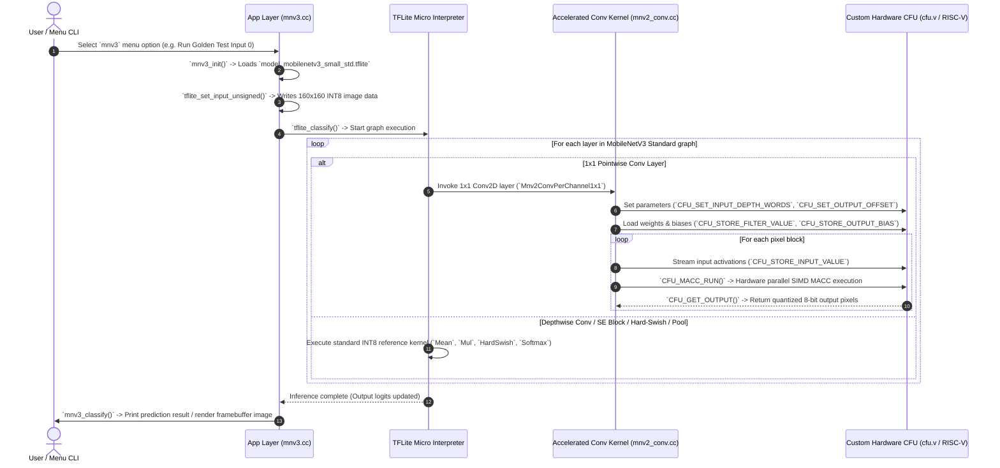

# MobileNetV3 Standard Small Execution Flow in CFU-Playground

This document details the complete architecture, hardware/software co-design, and execution flow of **MobileNetV3 Standard Small** within the **CFU-Playground** framework (`proj/mnv2_first`).

---

## 1. Overview & Architecture

CFU-Playground accelerates neural network inference on RISC-V SoCs implemented on FPGAs (or simulated using Renode).

In **MobileNetV3 Standard Small**, Neural Architecture Search (NAS) and NetAdapt discover layer topologies with optimal efficiency and accuracy:
1. **Squeeze-and-Excitation (SE) Modules**: Dynamically reweights channel-wise feature responses using Global Average Pooling, 1x1 squeeze conv, Hard-Sigmoid (`h-sigmoid`), and elementwise Multiply.
2. **Hard-Swish (`h-swish`) Activations**: Implements non-linear activation $\text{h-swish}(x) = x \cdot \frac{\text{ReLU6}(x+3)}{6}$ with efficient INT8 arithmetic.
3. **Hardware Acceleration via Custom Function Unit (CFU)**: The computationally dominant **1x1 Pointwise Convolutions** (which account for the vast majority of MACC operations) are offloaded to the 4-way SIMD Multiply-Accumulate (MACC) hardware CFU ([`cfu.v`](file:///home/victus_linux/cfu-playground-fork/CFU-Playground/proj/mnv2_first/cfu.v)).

---

## 2. Architecture Comparison

| Feature | MobileNetV2 | MobileNetV3 Minimalistic | MobileNetV3 Standard Small |
| :--- | :--- | :--- | :--- |
| **Activation Functions** | ReLU6 | ReLU6 | **Hard-Swish (`h-swish`) + Hard-Sigmoid (`h-sigmoid`) + ReLU** |
| **Attention Mechanism** | None | None | **Squeeze-and-Excitation (SE) Blocks** |
| **Topology Search** | Handcrafted inverted residuals | NAS optimized backbone | **NAS + NetAdapt optimized backbone** |
| **CFU 1x1 Conv Offloading** | Yes (`Mnv2ConvPerChannel1x1`) | Yes (`Mnv2ConvPerChannel1x1`) | **Yes (`Mnv2ConvPerChannel1x1`)** |
| **INT8 Quantized Size** | ~691 KB | ~369 KB | **~480 KB** |
| **Tensor Arena Size** | 800 KB | 800 KB | **1024 KB (1 MB)** |

---

## 3. End-to-End System Execution Flow



---

## 4. Step-by-Step Component Breakdown

### Step 1: Model Export & Application Initialization
* **Source Files**: 
  * [`common/src/models/mnv3/generate_mnv3_model.py`](file:///home/victus_linux/cfu-playground-fork/CFU-Playground/common/src/models/mnv3/generate_mnv3_model.py)
  * [`common/src/models/mnv3/mnv3.cc`](file:///home/victus_linux/cfu-playground-fork/CFU-Playground/common/src/models/mnv3/mnv3.cc)
  * [`common/src/models/mnv3/model_mobilenetv3_small_std.h`](file:///home/victus_linux/cfu-playground-fork/CFU-Playground/common/src/models/mnv3/model_mobilenetv3_small_std.h)
* **Actions**:
  1. `generate_mnv3_model.py` generates `model_mobilenetv3_small_std.tflite` (with `minimalistic=False`, `alpha=0.35`, `input_shape=(160, 160, 3)`).
  2. The Makefile auto-compiles `.tflite` and `.dat` files into C header byte arrays (`model_mobilenetv3_small_std.h` and `input_00001.h`).
  3. `mnv3_init()` loads the model into the TFLM runtime using `tflite_load_model()`.

### Step 2: Runtime Operator Resolution & Arena Allocation
* **Source Files**: 
  * [`common/src/tflite.cc`](file:///home/victus_linux/cfu-playground-fork/CFU-Playground/common/src/tflite.cc)
* **Actions**:
  1. `tflite_init()` instantiates `tflite::AllOpsResolver` supporting `CONV_2D`, `DEPTHWISE_CONV_2D`, `HARD_SWISH`, `MUL`, `MEAN`, `RESHAPE`, `ADD`, `PAD`, `SOFTMAX`.
  2. Allocates `kTensorArenaSize = 1024 * 1024` (1 MB) to provide memory for the model activations and SE branch buffers.

### Step 3: Hardware Offloading via CFU
* **Source Files**:
  * [`proj/mnv2_first/src/tensorflow/lite/kernels/internal/reference/integer_ops/conv.cc`](file:///home/victus_linux/cfu-playground-fork/CFU-Playground/proj/mnv2_first/src/tensorflow/lite/kernels/internal/reference/integer_ops/conv.cc)
  * [`proj/mnv2_first/cfu.v`](file:///home/victus_linux/cfu-playground-fork/CFU-Playground/proj/mnv2_first/cfu.v)
* **Actions**:
  1. 1x1 convolutions are routed to `Mnv2ConvPerChannel1x1()`.
  2. The SIMD MACC unit in `cfu.v` computes 4 multiply-accumulates per cycle with post-processing (bias addition, scaling, clipping to int8).

---

## 5. Build & Run Instructions

### Prerequisite: Set Environment PATH
```bash
export PATH=/home/victus_linux/cfu-playground-fork/CFU-Playground/env/conda/envs/cfu-common/bin:$PATH
```

### (Optional) Regenerate MobileNetV3 Standard Model
To regenerate the INT8 quantized model flatbuffer and test vectors:
```bash
python common/src/models/mnv3/generate_mnv3_model.py
```

### Step 1: Build Firmware & Elaboration
```bash
cd /home/victus_linux/cfu-playground-fork/CFU-Playground/proj/mnv2_first
make clean
make -j$(nproc)
```

### Step 2: Run Renode Emulation
```bash
make renode-headless
```
*(Or use `make renode` for GUI simulation with video framebuffer).*

### Step 3: Run Model from Interactive Console
1. Type `1` to enter **TfLM Models Menu**.
2. Select **MobileNetV3 Standard models**.
3. Press `g` to run **Golden test input 0** (or `z` for zeros input).
